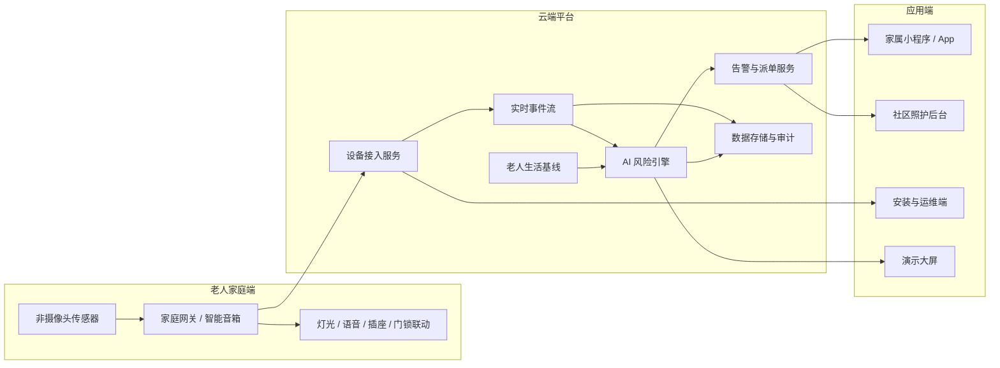
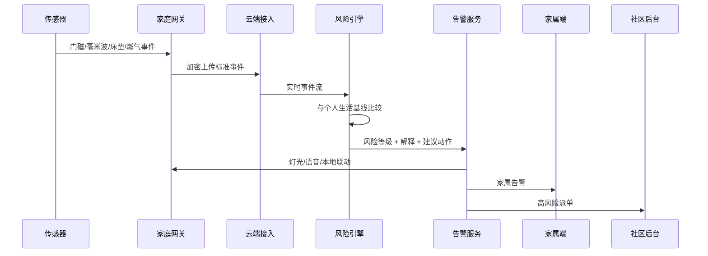

# CareTwin Home / 慧伴居公司级系统方案

## 1. 目标定位

慧伴居不是一个普通智能家居控制台，而是一套面向独居、半失能和轻度认知障碍老人的非摄像头居家安全监护与照护协同系统。

核心产品主张：

> 不依赖摄像头，通过非侵入式传感器学习老人的生活规律，在老人无法主动求助时提前发现风险，并联动灯光、语音提醒、家属通知和社区照护。

公司级系统需要支持三类价值：

- 对老人：减少隐私压力，在异常时获得及时提醒和照护确认。
- 对家属：在老人无法主动求助时收到可解释的风险通知。
- 对社区/机构：把分散家庭风险转化为可分级、可派单、可追踪的照护流程。

边界声明：

- 不使用摄像头作为核心监护方式。
- 不做医疗诊断，不声称判断具体疾病。
- 不替代急救、医院或专业护理。
- 输出的是异常模式、可能风险和照护建议，而不是医学结论。

## 2. 用户与使用场景

### 主要用户

- 独居老人：被动接受居家安全监护和语音提醒。
- 子女/家属：接收告警、查看老人状态、确认是否已处理。
- 社区照护员：处理多户老人风险事件和上门关怀任务。
- 养老机构/物业：管理多个房间或住户的安全状态。
- 安装与售后人员：绑定设备、检查信号、电池和网络状态。

### 核心场景

- 夜间卫生间滞留：起夜后长时间未返回卧室。
- 摔倒风险确认：姿态异常、地面高度、静止时长和房间活动共同判断。
- 长时间静止：毫米波存在、床垫压力、可穿戴心率等多源信息交叉确认。
- 阿尔茨海默症相关门安全：夜间开门、长时间门外停留、反复开门。
- 厨房安全：燃气、烟雾、灶具使用和人在场状态联动。
- 服药提醒：药盒开启、日程提醒和家属确认。

## 3. 总体架构

建议采用“家庭网关 + 云端风险引擎 + 多端应用”的架构。早期可以让传感器通过网关或第三方 IoT 平台接入，避免公司一开始就重资产自研硬件。

## 4. 家庭端设备方案

### 推荐传感器

| 设备 | 位置 | 作用 | 早期策略 |
| --- | --- | --- | --- |
| 门磁传感器 | 入户门、卧室门、卫生间门 | 判断开关门、夜间出门、如厕入口 | 采购成熟 Zigbee/BLE 设备 |
| 毫米波人体存在传感器 | 卧室、客厅、卫生间 | 判断是否有人、是否静止、是否跌倒姿态 | 优先选成熟模组 |
| 床垫/床边压力传感器 | 卧室 | 判断在床、离床、夜间起身 | 可作为重点差异化设备 |
| 烟雾/燃气传感器 | 厨房 | 厨房安全风险 | 直接集成成熟设备 |
| 智能插座/用电传感器 | 厨房、电器 | 判断异常用电或生活规律 | 可选 |
| 药盒传感器 | 餐桌/床头 | 判断药盒是否打开 | 早期可用模拟或简单硬件 |
| 可穿戴设备 | 老人身上 | 心率、步数、辅助摔倒确认 | 不作为唯一依赖 |

### 家庭网关

家庭网关可以是：

- 自研小网关：适合后期稳定产品化。
- 智能音箱/安卓盒子：适合早期试点。
- 第三方 IoT Hub：适合快速验证。

网关职责：

- 汇聚 Zigbee、BLE、Wi-Fi 或 Matter 设备数据。
- 在断网时保留基础本地告警能力。
- 执行本地联动，例如开夜灯、播放语音。
- 加密上传传感器事件到云端。

## 5. 云端平台

### 核心服务

| 服务 | 职责 |
| --- | --- |
| 设备接入服务 | 接收 MQTT/HTTP 传感器数据，校验设备身份 |
| 事件流服务 | 标准化传感器事件，写入实时流 |
| 风险引擎服务 | 计算风险分数、风险等级、触发动作和解释 |
| 用户与家庭服务 | 管理老人、家属、房屋、设备绑定关系 |
| 告警服务 | 发送 App/小程序/短信/电话/社区派单 |
| 照护任务服务 | 记录告警处理人、处理状态和回访记录 |
| 数据服务 | 存储事件、风险、设备状态和审计日志 |
| 运维监控服务 | 监控设备在线率、电池、网关心跳和服务健康 |

### 推荐技术栈

早期试点：

- Backend: FastAPI 或 Node.js
- Realtime: WebSocket + MQTT
- Database: PostgreSQL
- Time-series: PostgreSQL + TimescaleDB extension
- Cache/queue: Redis
- Deployment: Docker + managed cloud server

规模化阶段：

- API Gateway
- Kubernetes 或云厂商容器服务
- 消息队列：RabbitMQ、Kafka 或云消息队列
- 对象存储：保存导出报告、日志归档
- Observability：Prometheus/Grafana 或云监控

## 6. 数据流

每条风险更新都应包含：

- 风险分数：0-100
- 风险等级：Normal、Attention、Warning、High Risk
- 当前场景：例如夜间卫生间滞留
- 解释：为什么升高
- 触发动作：夜灯、语音、家属通知、社区照护
- 可追踪状态：已通知、已确认、已上门、已关闭

## 7. AI 风险引擎

### 第一阶段：规则引擎

先用确定性规则覆盖高价值场景：

- 夜间离床后进入卫生间，超过个人基线时长。
- 入户门夜间打开，且老人未返回室内活动区。
- 地面高度人体存在 + 长时间静止 + 无正常活动恢复。
- 厨房燃气/烟雾异常，且老人未离开风险区域。
- 药盒未开启且超过提醒窗口。

优势：

- 可解释。
- 适合演示和早期试点。
- 便于和家属、社区解释误报原因。

### 第二阶段：个体化基线

系统需要学习每位老人的日常规律：

- 起床、入睡、如厕、做饭、出门时间分布。
- 各房间停留时长基线。
- 夜间活动频率。
- 周内/周末差异。
- 设备误触发和家庭布局差异。

### 第三阶段：异常检测

在规则稳定后加入轻量 ML：

- 时间序列异常检测。
- 行为序列偏离检测。
- 多传感器一致性判断。
- 人群通用模型 + 个体微调。

原则：模型输出必须转化为人能理解的解释，不输出黑盒医学结论。

## 8. 应用端设计

### 家属端小程序 / App

核心功能：

- 实时风险告警。
- 查看老人当前安全状态。
- 查看风险解释和传感器证据。
- 一键确认、拨打电话、联系社区。
- 告警历史和趋势报告。

### 社区照护后台

核心功能：

- 多老人风险总览。
- 高风险事件队列。
- 派单、接单、处理和关闭。
- 老人档案、紧急联系人、上门记录。
- 设备离线、电池低电量提醒。

### 安装与运维端

核心功能：

- 房间建模和设备绑定。
- 传感器信号测试。
- 联动测试，例如夜灯、语音、门磁。
- 网关在线状态和电池状态。
- 售后问题记录。

### 演示大屏

当前网页 MVP 属于演示大屏，用于比赛、路演、客户演示和内部产品沟通。

它展示：

- 家庭平面图。
- 传感器事件流。
- AI 风险解释。
- 智能家居响应。
- 家属告警模拟。
- 全场景数字孪生动画。

## 9. 告警分级与处理闭环

| 等级 | 含义 | 系统动作 | 人工动作 |
| --- | --- | --- | --- |
| Normal | 正常生活规律 | 记录状态 | 无 |
| Attention | 轻微异常 | 夜灯、温和语音提醒 | 家属可查看 |
| Warning | 明显异常 | 家属推送、持续观察 | 家属确认 |
| High Risk | 需要尽快确认 | 家属强提醒、社区派单 | 电话/上门/应急流程 |

告警闭环：

1. 发现异常。
2. 系统解释原因。
3. 本地智能家居先行提醒。
4. 家属收到通知并确认。
5. 未确认或高风险时升级给社区照护。
6. 记录处理结果，用于后续优化规则。

## 10. 隐私、安全与合规

### 隐私原则

- 默认不采集摄像头画面。
- 只采集完成风险判断所需的最小传感器数据。
- 家属和社区只能查看授权范围内的数据。
- 对老人和家属明确说明数据用途。

### 安全要求

- 设备身份认证。
- 网关到云端加密传输。
- 账号权限分级。
- 敏感数据加密存储。
- 告警和处理记录可审计。
- 设备离线、篡改、电池低电量需要被监控。

### 合规边界

- 页面和通知避免使用“诊断”“确诊”“治疗”等词。
- 使用“可能风险”“异常模式”“需要确认”等表达。
- 明确系统不替代急救和专业医疗判断。
- 真实试点前需要准备隐私政策、用户授权书和数据处理协议。

## 11. 公司能力与团队分工

### 早期核心团队

| 角色 | 主要职责 |
| --- | --- |
| 产品负责人 | 场景定义、用户访谈、路演材料、试点客户 |
| 前端工程师 | 演示大屏、家属端、社区后台 |
| 后端工程师 | API、设备接入、风险服务、数据平台 |
| IoT 工程师 | 传感器选型、网关、设备协议 |
| 算法工程师 | 规则引擎、行为基线、异常检测 |
| 设计师 | 品牌、交互、老人/家属体验 |
| 运营/商务 | 社区、养老机构、物业、硬件供应链合作 |

### 外部合作

- 传感器供应商。
- 社区养老服务机构。
- 物业或居家养老平台。
- 医护/养老专家顾问。
- 云服务商。
- 小程序/App 发布平台。

## 12. 从 MVP 到真实产品路线图

### Phase A: 当前演示系统

目标：证明故事、界面和核心闭环。

已具备：

- React + FastAPI 演示系统。
- 场景脚本和数字孪生模拟。
- 风险评分和解释。
- 家庭平面图、动画和家属告警模拟。
- GitHub Pages 静态分享版。

### Phase B: 真实传感器 PoC

目标：用少量真实设备验证事件采集。

建议范围：

- 1 套家庭环境。
- 门磁、毫米波、床垫压力、燃气/烟雾传感器。
- 网关或第三方 IoT 平台。
- 云端接入真实事件。
- Web demo 同时支持模拟数据和真实数据。

### Phase C: 小规模试点

目标：验证误报率、家属接受度和照护流程。

建议范围：

- 5-20 户家庭。
- 家属小程序原型。
- 社区后台原型。
- 告警确认闭环。
- 设备离线和售后流程。

### Phase D: 可售卖产品

目标：形成标准化安装、运维和商业化能力。

需要完成：

- 标准硬件套装。
- 安装流程和服务手册。
- 订阅计费或机构采购方案。
- 数据安全和隐私合规材料。
- 7x24 或分时段告警响应机制。

## 13. 当前项目下一步建议

为了让现有 demo 更像公司产品，而不马上进入重硬件开发，建议下一步做三件事：

1. 在网页里增加“公司级系统架构/真实产品路线”展示页，用于路演说明。
2. 给数字孪生增加“真实设备映射层”，让每个虚拟传感器都对应未来可采购的硬件类型。
3. 增加“家属端/社区端”两个轻量页面，展示告警不是停留在大屏，而是进入真实照护流程。

这三步可以继续保持纯软件模拟，但会让项目从“网页 demo”升级成“公司产品雏形”。
